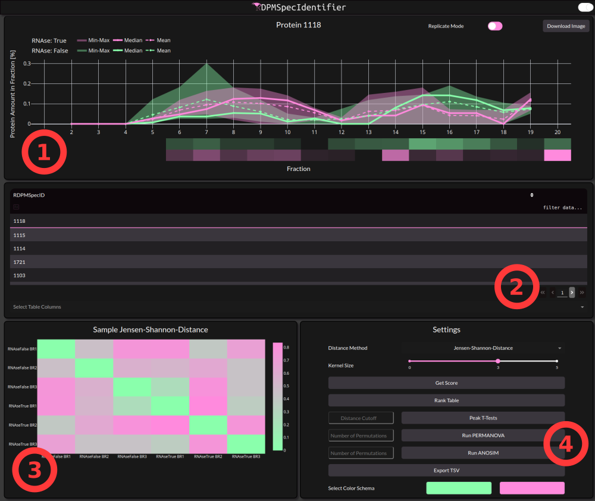

The Dashboard
#############

Once you see the Dash App running in your browser, you can inspect your data and run several tests and functions.
If you don´t know how to achieve that have a look into the :ref:`Running Dash Interface<running-dash-tutorial>` section.

Below you will find an image of the App with some descriptions underneath.

1 The Distribution Panel
------------------------

The distribution panel shows how the protein is spread along the gradient. An averaging Kernel with specified size is
used to calculate the amount of protein in each fraction. The Kernel size can be set via the Settings (4).
You can also find a pseudo-Westernblot from the mean of your Replictas. If you want to inspect each replicate seperately
you can trigger the Replicate Mode with the switch at the top of the panel.

2 The Data Table
----------------

As mentioned in the :ref:`Data Prepatation<data-prep-tutorial>` step. You can include lots of additional data in the
intensities file. Per Default only  the first column from that file is shown on App startup. However, you can select
additional columns via the **Select Table Columns** Input Field at the bottom. Once you calculated values using the
functionality from (4), those values will also show up in the table. You can also click a row or use the arrow keys to
navigate through your proteins and select which Protein to show in the Distribution Panel.

3 Sample Heatmap
----------------

This heatmap shows the distances between samples using the distance method specified in the Settings (4). If the
treatment had some effect, the between group distances is supposed to be higher than the within group distances.

4 Settings
----------

The Settings box is used to analyze your data. The purpose of the provided functionality is to analyze multivariate data.

Distance Method
+++++++++++++++

Here you can select a distance metric to calculate the distance between samples. We strongly recommend to use the
Jensen-Shannon-Distance here.

Kernel Size
+++++++++++

Per default an averaging kernel is run over the fractions. This will reduce the variance of samples in case that
fractionation
did not work perfectly.

Get Score
+++++++++

Calculates the default values that you can use to rank your table. Those values are

.. list-table::
   :widths: 25 75
   :header-rows: 1

   * - Value
     - Explanation
   * - ANOSIM R
     - The ANOSIM R Value ranges between -1 and 1. Proteins that show a different distribution upon RNAse treatment will have a higher R value (ideally 1). This value can be used instead of a p-Value if you have a low number of replicates (approximately < 5).
   * - Mean Distance
     - Mean Jensen-Shannon-Distance between treated and untreated replicates. This is a measure of effect size of the treatment.
   * - shift direction
     - The direction in which the protein shifts upon RNAse treatment.
   * - RNAse False peak pos
     - The fraction of the control from which the largest shift in probability mass towards the RNAse treated samples is detected.
   * - RNAse True peak pos
     - The fraction from the RNAse from which the largest shift in probability mass towards the control samples is detected.

.. _rank-table:
Rank Table
++++++++++

This will ad a rank to the table considering the current sorting. For instance if you have
an insufficient number of samples for a PERMANOVA you might consider ranking the table based on a sorting using
**ANOSIM R** and the **Mean Distance**.

Peak T-Tests
++++++++++++

Performs Welchs T-Tests to determine whether there is a significant difference at the RNAse or Control peaks.

.. warning::
    Since you are dealing with multivariate data, this is not the recommended way to calculate p-Values.
    Instead use a PERMANOVA if you have a sufficient amount of replicates or consider ranking the Table using
    values calculated via the Get Scores button. (see :ref:`Rank Table<rank-table>`)

Run PERMANOVA
+++++++++++++

Performs a Permanova to calculate whether RNAse treatment leads to a difference in the distribution of the Proteins.
You can select the number of permutations via the Input Field next to the button. The Default is 999.

.. note::
    This is the recommended way to calculate a p-Value if you have more than 5 replicates per group.

Run ANOSIM
++++++++++

Performs ANOSIM to calculate whether RNAse treatment leads to a difference in the distribution of the Proteins.
You can select the number of permutations via the Input Field next to the button. The Default is 999.

.. note::
    This is the recommended way to calculate a p-Value if you have doubts that the underlying data meets the
    requirements for a PERMANOVA

Export TSV
++++++++++
This will export the Data Table with all the values calculated using the buttons above.

Select Color Scheme
+++++++++++++++++++
If you dont like the default colors you can change them here.

