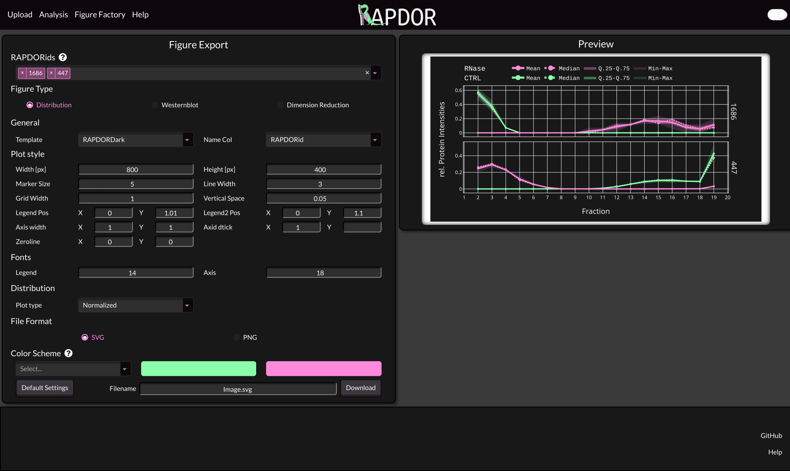

Figure Factory
##############

.. currentmodule:: RAPDOR

The figure factory provides an interface to create and download high quality svg plots of your uploaded data.
You can select multiple proteins at once via the dropdown menu. Note that it is also possible to select them via the
checkboxes in the table on the analysis page. If you select the Dimension Reduction plot, it will highlight the selected
proteins instead.

.. note::

    It is possible to plot via the Python API using plotly figures. You can find the documentation in the
    :mod:`RAPDOR.plots` section: