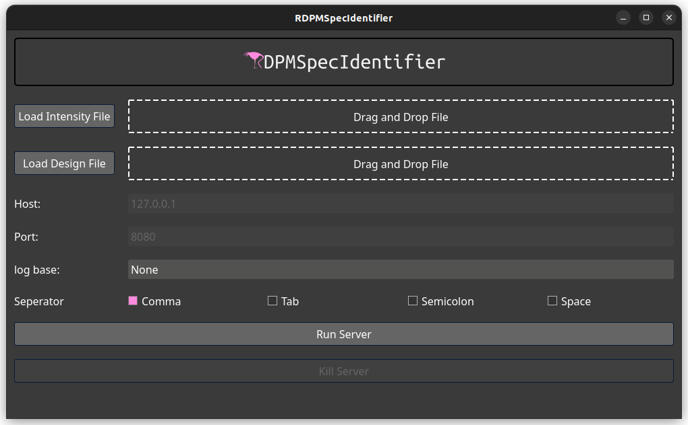

.. _running-dash-tutorial:
Running Dash Interface
######################

.. note::
    To run the Dash interface make sure you prepared your data according to :ref:`Data Prepatation<data-prep-tutorial>`.

Command Line Executables
------------------------

In case you installed RDPMSpecIdentifier via a package manager
you can run the Dash Interface via the following command:

.. code-block:: bash

    RDPMSpecIdentifier Dash --input /path/to/IntensityTable.csv --design /path/to/DesignTabel.csv

Further flags (e.g. if your data is already log transformed) can be found in the :ref:`CLI Documentation<cli-doc>`

Once you executed that command make sure to not close the terminal.
You can then open the corresponding page in a browser (e.g. Firefox, Chrome).
Per default the app will be run under the following address. However, this can be changed.

    `http://127.0.0.1:8080/ <http://127.0.0.1:8080/>`_

Graphical User Interface Executables
------------------------------------

If you are using a packed executable you can run the App via double click. This will take some time.

.. warning::

    Do not close the terminal that opens after double clicking

Once the App is running you will see the Graphical User Interface which looks like the image below.
Here you can drag and drop the files that you prepared
in the :ref:`Data Prepatation<data-prep-tutorial>` step. Further you can select the separator in your file and whether
the intensities are already log transformed. Then you can click on Run Server. If everything was set up correctly it will
open a Browser Tab in which you will see the Dashboard. A message below the Run Server and Kill Server Buttons indicates
whether the Server is still running. If something went wrong (e.g. your prepared files dont have the expected format)
you will see the message "Server crashed".

.. note::

    If you installed the package via a package manager you can still use the GUI via running the following command from
    a terminal:

    .. code-block:: bash

        RDPMSpecIdentifier GUI

